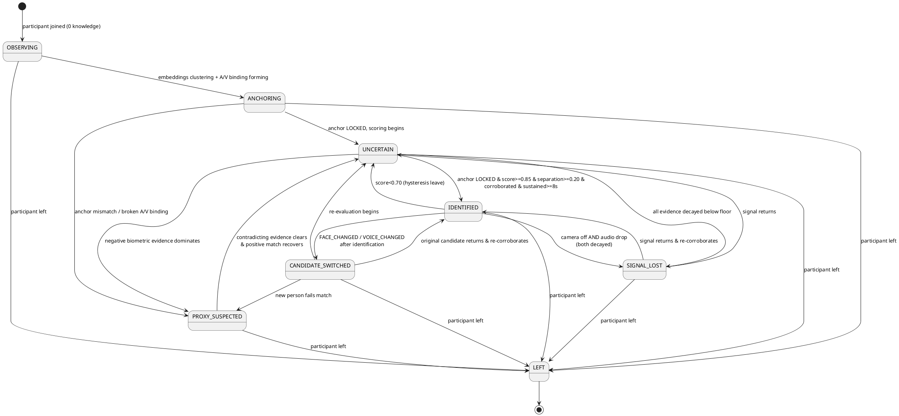

# 06 — Candidate Identity State Machine

The Confidence Engine drives a per-participant state machine. State is a **classification of the current belief**, with hysteresis (see doc 05 §5) so transitions are deliberate, not flickery.

## 1. States

| State | Meaning | Typical trigger |
|---|---|---|
| `OBSERVING` | Just joined; **zero-knowledge** — collecting embeddings, anchor not yet formed | New participant, no anchor lock yet |
| `ANCHORING` | Enough signal to form the self-built anchor; provisional identity taking shape | Embeddings clustering + A/V binding stabilizing |
| `UNCERTAIN` | Anchor exists but evidence is below the identification bar or ambiguous | Mixed / thin / decayed evidence |
| `IDENTIFIED` | High confidence this participant is consistent with the anchored candidate | Anchor LOCKED + score ≥ enter-threshold, separation, corroboration, sustained |
| `PROXY_SUSPECTED` | Present person's biometrics contradict the anchor (or a live reference) | `ANCHOR_MISMATCH` / `AV_BINDING_BROKEN` / `VOICE` mismatch dominates |
| `CANDIDATE_SWITCHED` | Identity changed mid-session | `FACE_CHANGED` / `VOICE_CHANGED` after a prior IDENTIFIED |
| `SIGNAL_LOST` | Was tracked, now no live signal (camera+audio both decayed) | All evidence decayed below floor, participant still present |
| `LEFT` | Participant left the meeting | `PARTICIPANT_LEFT` |

## 2. State Diagram (PlantUML)

## 3. Transition Rules (guards)

Transitions are guarded, not just event-driven — the same event yields different transitions depending on current state and score:

| From → To | Guard |
|---|---|
| `* → IDENTIFIED` | **anchor is LOCKED** **AND** `score ≥ 0.85` **AND** `separation ≥ 0.20` **AND** `corroboratingModalities ≥ 2` **AND** `dwell ≥ 8s` |
| `IDENTIFIED → UNCERTAIN` | `score < 0.70` (asymmetric with entry — hysteresis) |
| `* → PROXY_SUSPECTED` | net negative biometric contribution over window **AND** a present-but-mismatched face/voice |
| `IDENTIFIED → CANDIDATE_SWITCHED` | `FACE_CHANGED` or `VOICE_CHANGED` with reliability above threshold, after being IDENTIFIED |
| `* → SIGNAL_LOST` | all evidence decayed below floor **AND** participant not `LEFT` |
| `* → LEFT` | `PARTICIPANT_LEFT` event |

## 4. Side Effects of Transitions

| Transition | Side effects |
|---|---|
| `→ IDENTIFIED` | Emit `confidence.update`; Timeline `STATE_CHANGE`; WS push; Notification `INFO`. |
| `→ PROXY_SUSPECTED` | Emit update; Timeline `ALERT`; Notification `CRITICAL` (email + webhook + UI). |
| `→ CANDIDATE_SWITCHED` | Emit update; Timeline `ALERT`; Notification `CRITICAL`; snapshot embeddings for review. |
| `→ SIGNAL_LOST` | Emit update; Timeline `INFO`; **do not** drop the belief — freeze and let decay continue slowly. |
| `→ LEFT` | Freeze state; stop decay ticker; persist final snapshot. |

## 5. Meeting-Level Verdict

The **per-meeting verdict** is derived from the per-participant states:

- If exactly one participant is `IDENTIFIED` → that is the candidate.
- If none reach `IDENTIFIED` → verdict is `UNCERTAIN` (surface the top participant + why).
- If a `PROXY_SUSPECTED` or `CANDIDATE_SWITCHED` participant is the argmax → verdict escalates the alert; the UI shows the concern prominently rather than a false "identified".

This meeting-level rollup lives in `confidence.verdicts` (versioned) and is what the dashboard's headline panel renders.

---

*Previous: [05 — Confidence Engine](./05-confidence-engine.md) · Next: [07 — Sequence Diagrams](./07-sequence-diagrams.md)*
