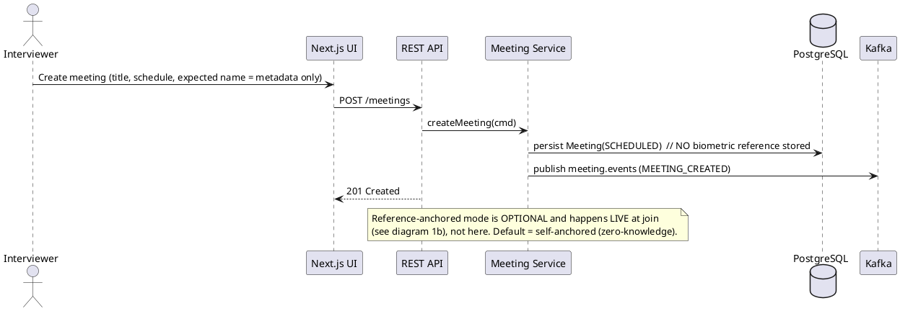
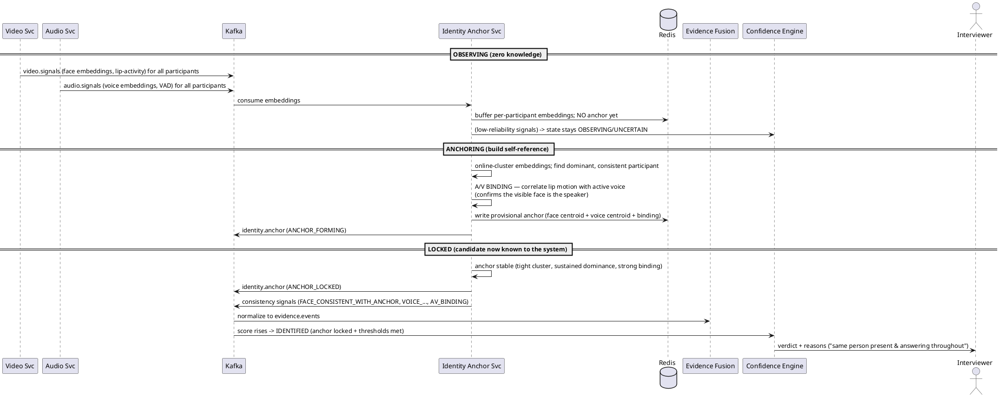
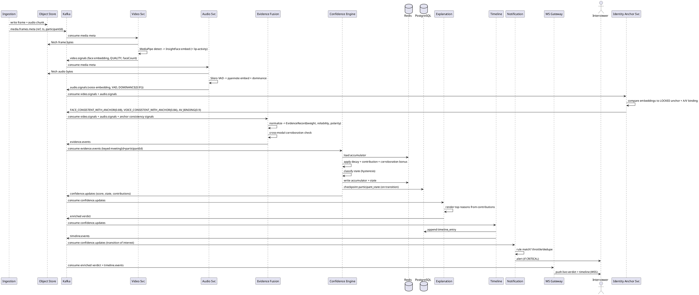
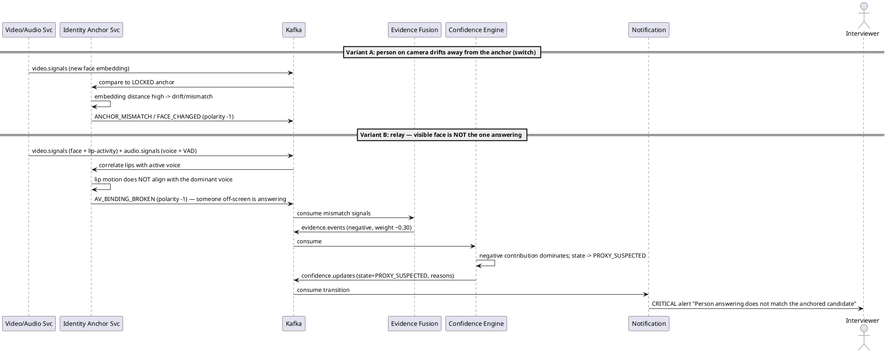
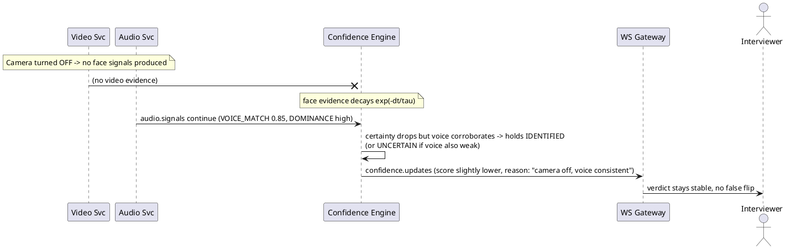
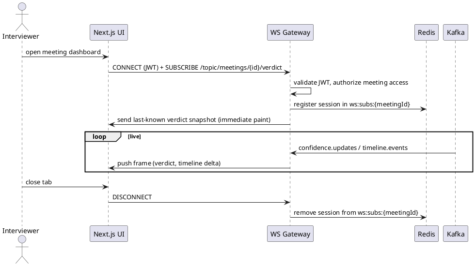

# 07 — Sequence Diagrams (PlantUML)

Render with any PlantUML tool. These cover the flows that matter most for review.

## 1. Meeting Setup — No Reference Upload (Control Plane)

The system starts with **zero biometric knowledge**. Setup only creates the meeting; there is **no candidate photo/voice upload**. A reference is *optional* and, if used, is captured **live at join** (an ID-verification step), never pre-supplied by the interviewer.

## 1b. Cold-Start Identity Anchoring (the "0 info → candidate known" flow)

This is the flow that answers *"where does the reference come from?"* — Sherlock **builds it from the interview itself**.

## 2. Live Signal → Verdict (Data Plane, the core loop)

## 3. Proxy Detection Flow (two variants — both work with NO reference)

## 4. Camera-Off Graceful Degradation

## 5. Client Subscription & Live Push (WebSocket)

---

*Previous: [06 — State Machine](./06-state-machine.md) · Next: [08 — API Gateway & Contracts](./08-api-gateway.md)*
